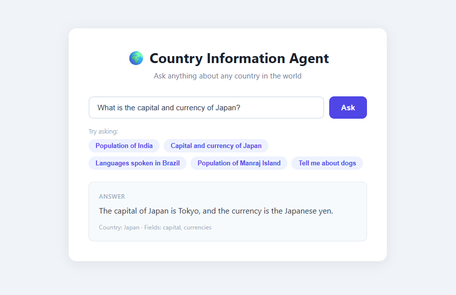
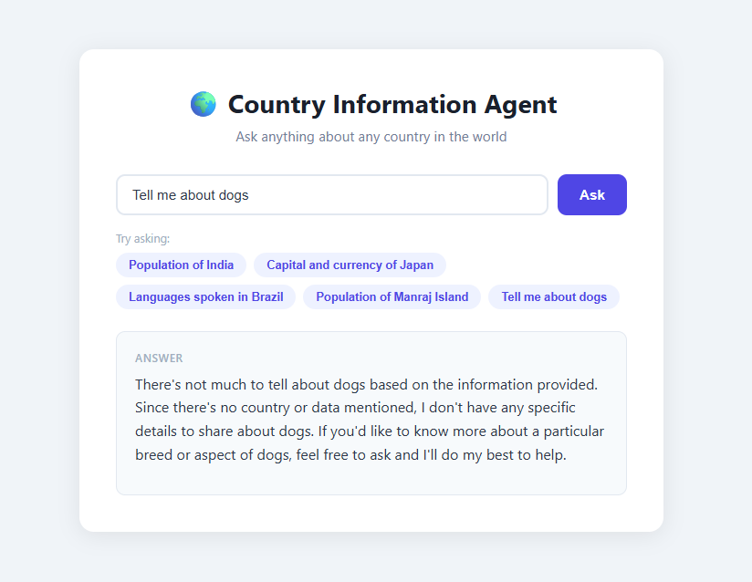

# 🌍 Country Information AI Agent

An AI-powered agent that answers natural language questions about countries using a multi-step LangGraph pipeline and the public REST Countries API.

> "What is the capital and currency of Japan?" → **The capital of Japan is Tokyo. Japan's official currency is the Japanese yen (JPY).**

<table>
  <tr>
    <td></td>
    <td></td>
  </tr>
</table>

---

## What This Is

This is a production-structured AI agent built with LangGraph that takes a plain English question about any country and returns a grounded, accurate answer. It does not guess or hallucinate — every answer is derived strictly from live API data.

The agent follows a three-step reasoning pipeline:

```
User Question → Intent Extraction → Data Retrieval → Answer Synthesis
```

Each step is a discrete, testable node in a LangGraph state graph.

---

## Why It's Useful

Most LLM-based Q&A systems answer directly from model memory — which means answers can be outdated, hallucinated, or wrong. This agent solves that by:

- **Grounding every answer in live data** from the REST Countries API
- **Decomposing the problem** into intent classification, tool use, and synthesis — the same architecture used in production AI systems
- **Handling failure gracefully** — invalid questions, unknown countries, and API errors all return clean, user-friendly responses

---

## Overall Architecture

The system is composed of four distinct layers, each with a single responsibility:

```
┌──────────────────────────────────────────────────────────┐
│                      FastAPI Layer                       │
│          POST /ask    GET /    GET /health               │
│          Input validation (Pydantic) + error handling    │
└─────────────────────────┬────────────────────────────────┘
                          │
                          ▼
┌──────────────────────────────────────────────────────────┐
│                    LangGraph Agent                       │
│                                                          │
│  ┌─────────────┐    ┌────────────┐    ┌───────────────┐  │
│  │ intent_node │───►│ tool_node  │───►│synthesize_node│  │
│  │             │    │            │    │               │  │
│  │  LLM call   │    │  No LLM    │    │   LLM call    │  │
│  │  Classifies │    │  Pure API  │    │   Narrates    │  │
│  │  question   │    │  retrieval │    │   data        │  │
│  └─────────────┘    └────────────┘    └───────────────┘  │
│         │                                                │
│         └── is_valid=False ──► synthesize_node directly  │
└─────────────────────────┬────────────────────────────────┘
                          │
                          ▼
┌──────────────────────────────────────────────────────────┐
│                     Tools Layer                          │
│               tools/countries_api.py                     │
│                                                          │
│    fetch_country_data()          extract_fields()        │
│    HTTP call + error handling    Canonical field map     │
└─────────────────────────┬────────────────────────────────┘
                          │
                          ▼
┌──────────────────────────────────────────────────────────┐
│                 REST Countries API                       │
│       https://restcountries.com/v3.1/name/{country}      │
│             No auth · No rate limit · Live data          │
└──────────────────────────────────────────────────────────┘
```

### Key Architectural Decisions

**Separation of LLM and deterministic logic** — the tool node makes zero LLM calls. Data retrieval is fully deterministic and independently testable. Only the intent and synthesis nodes touch the LLM.

**Shared state via `AgentState`** — all three nodes communicate through a single `TypedDict` state object. Each node reads what it needs and writes only the keys it owns. No node modifies another node's keys.

**`(data, error)` tuple pattern** — the API wrapper returns `(dict | None, str | None)` instead of raising exceptions. This keeps error handling local to each layer and ensures the synthesis node always runs — users always receive a response.

**Config as a single instance** — all environment-aware settings live in one `config` object imported across the codebase. Swapping models, timeouts, or URLs requires changing one file.

---

## Agent Flow — Traced Example

**User question:** `"What is the capital and currency of Japan?"`

---

### Step 1 — FastAPI receives the request

```json
POST /ask
{ "question": "What is the capital and currency of Japan?" }
```

Pydantic validates the input — strips whitespace, rejects empty strings. The graph is invoked with a fully initialized state:

```python
{
  "question": "What is the capital and currency of Japan?",
  "country_name": None,
  "requested_fields": [],
  "is_valid": False,
  "raw_country_data": None,
  "tool_error": None,
  "final_answer": None
}
```

---

### Step 2 — Intent Node runs

The LLM receives a structured system prompt listing all allowed field names and is instructed to return only JSON. It responds:

```json
{
  "country_name": "Japan",
  "requested_fields": ["capital", "currencies"],
  "is_valid": true
}
```

The node performs secondary validation — confirms `country_name` is not null, `requested_fields` is not empty, and filters out any field names not present in the canonical `FIELD_MAP`. State after this node:

```python
{
  "country_name": "Japan",
  "requested_fields": ["capital", "currencies"],
  "is_valid": True,
  ...
}
```

---

### Step 3 — Conditional Edge routes to Tool Node

`is_valid=True` → the graph routes to `tool_node`.
`is_valid=False` → the graph would skip directly to `synthesize_node`.

---

### Step 4 — Tool Node runs

No LLM call. The node calls:

```
GET https://restcountries.com/v3.1/name/Japan
```

The API returns the full country object. The node extracts only the two requested fields using the canonical field map:

```python
{
  "capital": "Tokyo",
  "currencies": {"JPY": "Japanese yen"}
}
```

State after this node:

```python
{
  "raw_country_data": {"capital": "Tokyo", "currencies": {"JPY": "Japanese yen"}},
  "tool_error": None,
  ...
}
```

---

### Step 5 — Synthesis Node runs

The LLM receives the extracted data and the original question, with a strict instruction to narrate only what it was given:

```
User question: What is the capital and currency of Japan?
Country: Japan
Data: {"capital": "Tokyo", "currencies": {"JPY": "Japanese yen"}}

Answer the user's question naturally based strictly on the data above.
```

LLM produces:

```
The capital of Japan is Tokyo. Japan's official currency is the Japanese yen (JPY).
```

---

### Step 6 — FastAPI returns the response

```json
{
  "answer": "The capital of Japan is Tokyo. Japan's official currency is the Japanese yen (JPY).",
  "country": "Japan",
  "fields_requested": ["capital", "currencies"]
}
```

Total time: ~2–3 seconds (two LLM calls + one API call).

---

## How the System Behaves

### Happy Path

A well-formed question about a real country with a recognized field produces a grounded, accurate answer in 2–4 seconds. The answer reflects live API data, not model memory.

### Invalid or Unrecognizable Question

```
"Tell me about dogs"
"Who won the World Cup?"
"What is the best country?"
```

The intent node sets `is_valid=False`. The graph short-circuits — the tool node never runs. The synthesis node receives no data and produces a polite clarification response. No API call is made.

### Country Not Found

```
"What is the population of Narnia?"
```

The intent node marks this as valid — it found a country name and a field. The tool node calls the API, receives a 404, and sets `tool_error`. The synthesis node narrates the error gracefully:

> *"I wasn't able to find any information about Narnia. Please check the country name and try again."*

### Partial Data

If a field is in `requested_fields` but missing from the API response, `extract_fields` stores `None` for that field rather than crashing. The synthesis node is instructed to say that information is not available for null fields.

### API Timeout or Network Error

The tool node catches `requests.Timeout` and `requests.RequestException` separately, sets a descriptive `tool_error`, and returns cleanly. The synthesis node always produces a user-facing response — the user never sees a raw exception.

### Ambiguous or Hallucinated Field Names

If the LLM returns a field name that looks plausible but is not in `FIELD_MAP` (e.g. `"gdp"`, `"president"`), the intent node silently filters it out and logs a warning. The remaining valid fields are still processed normally.

---

## Known Limitations and Trade-offs

### LLM-Dependent Intent Classification

The intent node relies on an LLM to classify the question. This introduces:

- **Latency** — every request makes at least two LLM calls (intent + synthesis), adding 1–3 seconds compared to a rule-based classifier
- **Non-determinism** — even at `temperature=0`, the model can occasionally misclassify questions or return unexpected field names
- **Cost** — each question consumes tokens on both the intent and synthesis steps, which matters at scale

**Trade-off accepted:** A regex or rule-based classifier would be faster and cheaper but would fail on natural language variation. The LLM handles phrasing like "What's the population", "How many people live in", and "Tell me the population of" identically — a rule-based system cannot.

---

### Fixed Field Map

The canonical `FIELD_MAP` covers ten fields: population, capital, currencies, languages, area, region, subregion, flag, borders, and timezones. If a user asks about GDP, president, national anthem, or any field not in the map, the agent cannot answer.

**Trade-off accepted:** A dynamic field mapper would require the LLM to generate API paths, which significantly increases hallucination risk. The fixed map is explicit, testable, and safe — every supported field has a known extraction path.

---

### No Conversation Memory

Each request is fully stateless. The agent has no memory of previous questions in the same session. A follow-up like "What about its currency?" after asking about Germany's population will fail — the agent has no context of what "it" refers to.

**Trade-off accepted:** Adding memory requires persistent storage (Redis, database) or an in-memory conversation history, which was explicitly excluded from the project constraints. This is the correct scope for a stateless REST API service.

---

### Single Country Per Question

The agent extracts one country name per question. Comparative or multi-entity questions are not supported:

```
"Compare the population of India and China"   ← not supported
"Which is larger, Brazil or Australia?"       ← not supported
```

The intent node will pick one country and ignore the other.

**Trade-off accepted:** Multi-entity resolution would require parallel tool calls and a comparative synthesis step — a meaningful architectural expansion. The current design handles the stated scope cleanly.

---

## Tech Stack

| Layer | Technology |
|---|---|
| Agent framework | LangGraph |
| LLM | Groq (`llama-3.1-8b-instant`) |
| LLM client | LangChain Groq |
| Data source | REST Countries API (no auth) |
| Web framework | FastAPI |
| Validation | Pydantic v2 |
| Testing | pytest + unittest.mock |

---

## Local Setup

### Prerequisites

- Python 3.11+
- A [Groq API key](https://console.groq.com) (free tier available)

### Steps

**1. Clone the repository**

```bash
git clone https://github.com/your-username/country-agent.git
cd country-agent
```

**2. Create and activate a virtual environment**

```bash
python -m venv .venv

# Windows
.venv\Scripts\activate

# Mac/Linux
source .venv/bin/activate
```

**3. Install dependencies**

```bash
pip install -r requirements.txt
```

**4. Set up environment variables**

```bash
cp .env.example .env
```

Open `.env` and fill in your values:

```env
LLM_API_KEY=your_groq_api_key_here
MODEL_NAME=llama-3.1-8b-instant
LOG_LEVEL=INFO
```

> **Corporate network / VPN users:** If you're behind an SSL-intercepting proxy, add `DISABLE_SSL_VERIFY=true` to your `.env`. Never use this in production.

**5. Run the server**

```bash
uvicorn main:app --reload
```

**6. Open in your browser**

```
http://localhost:8000        ← Frontend UI
http://localhost:8000/docs   ← Swagger / API docs
http://localhost:8000/health ← Health check
```

---

## Running Tests

```bash
python -m pytest tests/ -v
```
